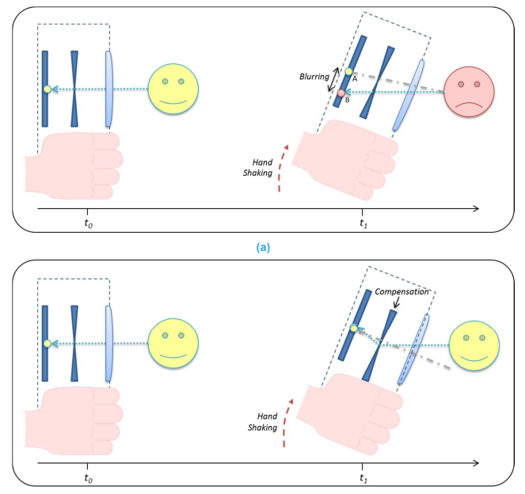
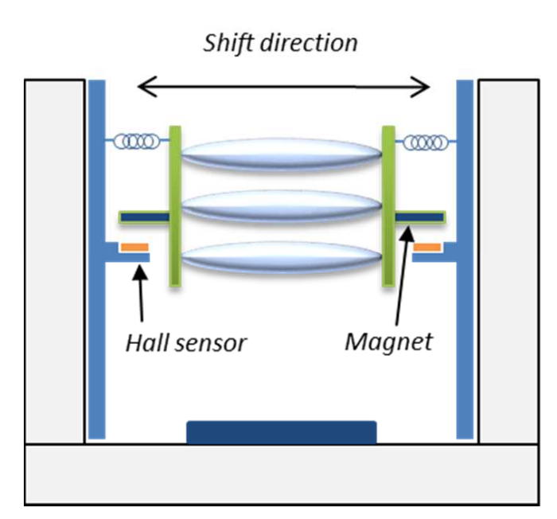
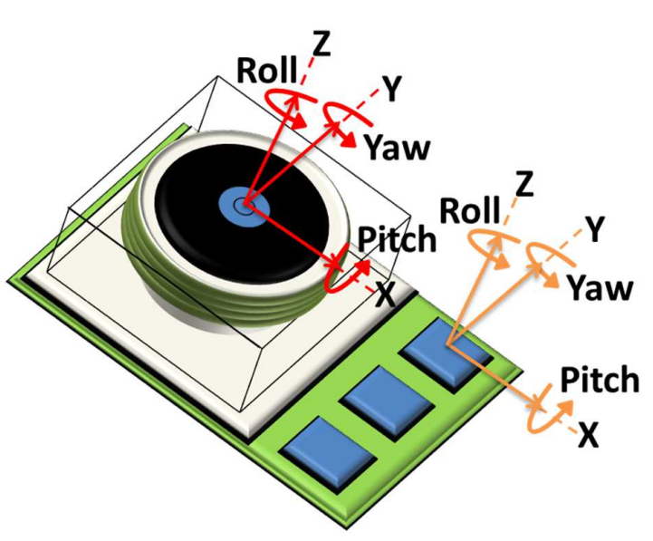
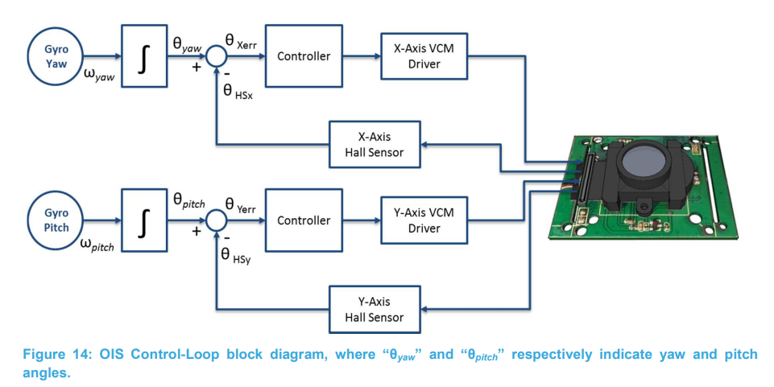
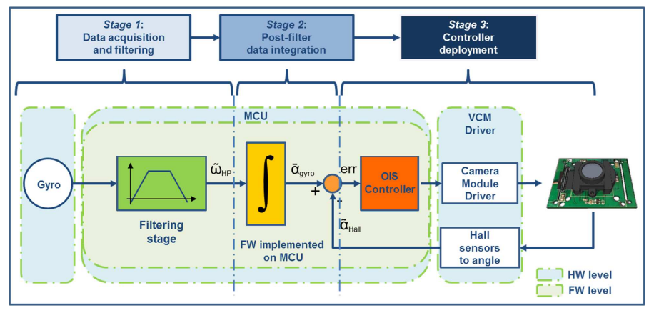
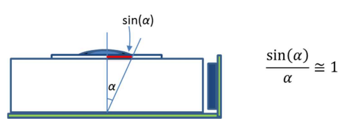

# ST OIS white paper

> 本文的写作时间较早（2015年），对经典的OIS技术有一个较好的总览与概述。

OIS一般用于手机上，用于提升手持式拍摄的质量。因为人的肌肉结构会出现自然抖动，频率一般在0~20Hz，所以手持拍摄容易出现模糊现象。这种相机运动模糊在低亮度的情况下，由于曝光时间增长，模糊强度会更严重。

音圈马达是一种常用的OIS机械结构，属于位移式补偿。它通过电磁安培力来使得镜头位移，通常由永磁体与线圈联合工作。镜头的当前位置由霍尔器件测量获得。

镜头的抖动一般通过陀螺仪进行测量，其中最常用的还是pitch和yaw两轴，因为人拍摄的时候通常不会出现大的位移，而是出现不自觉的手机倾斜。陀螺仪通常就集成在相机模块内，这样可以最大限度保证测量的准确。

OIS镜头一般是自控制的，镜头中集成了MCU、传感器和执行器，手机通常不用与之交互。这也是OIS受人欢迎的一大原因。

陀螺仪采集的角速度经过积分后成为偏移角度，这是需要补偿的目标量/输入量；然后在闭环中，由MCU作为控制器来控制音圈马达执行X/Y轴的位移，其位移被霍尔器件所采集，与目标量做差，形成经典的闭环控制。从上图可以看到，X/Y轴的控制、观测通常是分离的。

上图中，蓝色框里是硬件部分，绿色框里的是固件部分。OIS的控制算法主要分为三个阶段：第一个是对原始信号进行滤波，目的在于解决陀螺仪的零漂问题；第二个是对信号进行积分，将角速度转化为偏移角度；第三个是进行操纵音圈马达进行闭环控制，控制频率一般为500~5000Hz。

由于抖动幅度相对较小，可以使用小角度近似。陀螺仪测量到的数值以近似线性的方式转化为水平位移。
